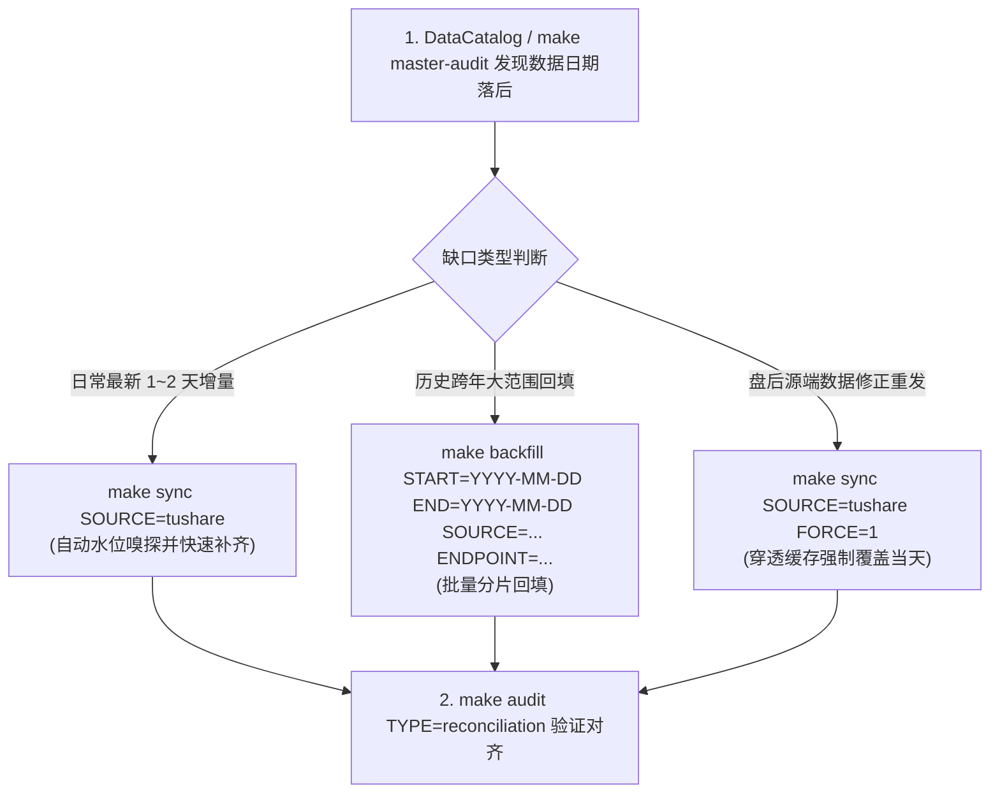

# 数据资产目录服务 (DataCatalog) 技能指南

本技能为量化投研系统提供统一的**本地落盘数据资产盘点、最新水位嗅探、数据加载与缺口诊断**的标准操作指南。

---

## 1. 核心 Python API 速查 (标准调用规范)

`DataCatalog` 提供了高容错、自动路由别名的标准方法，不再需要手写底层 Parquet 遍历代码：

### ① 一键输出全库/单源资产大盘看板 (`summary`)
```python
from stock.data.catalog import DataCatalog

catalog = DataCatalog()

# 查看全库所有数据源 (TuShare / LiXinger / YFinance / FRED) 完整看板
df_all = catalog.summary()
print(df_all)

# 查看指定数据源 (如 tushare) 资产清单
df_ts = catalog.summary(data_source="tushare")
print(df_ts)
```

### ② 毫秒级查询指定数据集最新落盘交易日 (`get_latest_trade_date`)
内置任务短别名自动解析（如传入 `daily` 自动映射到真实目录 `stock_daily_bar`）：

```python
from stock.data.catalog import DataCatalog

catalog = DataCatalog()

# 查询 A 股全市场日 K 最新落盘日期 (支持别名 'daily' 或 'stock_daily_bar')
latest_bar = catalog.get_latest_trade_date("daily", data_source="tushare")
# -> date(2026, 8, 14)

# 查询 ETF 份额规模最新日期
latest_etf = catalog.get_latest_trade_date("etf_share_size", data_source="tushare")
# -> date(2026, 8, 13)

# 查询美股巨头行情最新日期
latest_us = catalog.get_latest_trade_date("stock_daily_bar", data_source="yfinance")
# -> date(2026, 8, 14)
```

### ③ 列出已落盘的数据集清单 (`list_datasets`)
```python
# 列出全库所有已落盘的数据集名称
all_datasets = catalog.list_datasets(data_source="all")

# 列出 TuShare 已落盘的数据集名称
ts_datasets = catalog.list_datasets(data_source="tushare")
```

### ④ 安全加载行情黄金表用于回测 (`load_daily_bars`)
自带去重、时钟对齐、别名归一与 OHLC 物理有效性校验：

```python
from datetime import date
from stock.data.catalog import DataCatalog

catalog = DataCatalog(data_source="tushare")

# 加载贵州茅台 2026 年以来的前复权日 K 线
df_bars = catalog.load_daily_bars(
    symbols=["600519.SH"],
    start_date=date(2026, 1, 1),
    end_date=date(2026, 8, 14),
    adjustment="qfq",
)
```

---

## 2. 终端 CLI 快捷指令

无需进入 Python 代码，终端提供开箱即用的资产盘点命令：

```bash
# 1. 全库 Parquet 物理主审计盘点 (包含行数、标的数、起止时间与文件健康度)
make master-audit

# 2. 因子专项对账审计 (复权因子与申万行业行情覆盖率)
make audit TYPE=factor

# 3. 估值指标专项对账审计 (daily_basic 与 index_fundamental 对齐率)
make audit TYPE=valuation

# 4. RAW vs Curated 双向物理对账 (确保清洗过程零丢行)
make audit TYPE=reconciliation
```

---

## 3. 常见自愈与增量补齐工作流

当通过 `DataCatalog` 发现数据存在缺口时，推荐的标准处置流程：


