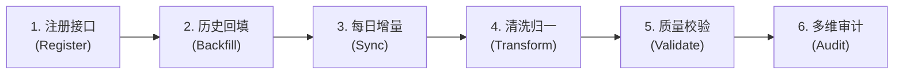

# 核心数据管道 (Data Pipeline) 工作流指南

本技能为量化投研系统提供 **5 大真实数据源**（TuShare、理杏仁、Yahoo Finance、FRED、Alpha Vantage）的生命周期数据工程标准化操作指南。

遵循**渐进式披露**原则，本入口聚合日常高频运维操作闭环，深度配置与排错请查阅对应专题。

---

## 1. 日常数据工程 6 步闭环速查表



| 核心操作环节 | 目标与职责 | 核心 CLI 命令 / 关键入口 | 详细指引文档 |
| :--- | :--- | :--- | :--- |
| **① 注册新接口** | 定义 API 元数据、单位倍率与任务路由 | [`src/stock_data/core/task_registry.py`](file:///Users/mac/workspace/personal/finance/stock/src/stock_data/core/task_registry.py) | [接口注册 5 步流水线](file:///Users/mac/workspace/personal/finance/stock/.agents/skills/data-pipeline/references/01_endpoint_registration.md) |
| **② 历史全量回填** | 12 年 K 线/估值/宏观批量拉取与 2-Tier ETL | `make backfill START=... END=... SOURCE=...` | [5 大数据源回填手册](file:///Users/mac/workspace/personal/finance/stock/.agents/skills/data-pipeline/references/02_backfill_recipes.md) |
| **③ 每日增量采集** | 盘后水位自动嗅探、波次保护与增量对账 | `make sync SOURCE=tushare` / `make sync SOURCE=lixinger` / `make sync SOURCE=all`（跨源串行） | [增量同步与调度模板](file:///Users/mac/workspace/personal/finance/stock/.agents/skills/data-pipeline/references/03_sync_and_scheduling.md) |
| **④ 清洗与标准化** | RAW 原始保真，Curated 统一金额/股本为标准单位 | `src/stock_data/pipeline/normalizer/unit_normalizer.py` | [单位与 Schema 规范](file:///Users/mac/workspace/personal/finance/stock/.agents/skills/data-pipeline/references/04_audit_ops_troubleshooting.md#②-单位口径与数值倍率原则) |
| **⑤ 质量与门禁** | 运行时隔离区检查与数据源探针健康检测 | `make probe` / `make validate` | [质量门禁与隔离区机制](file:///Users/mac/workspace/personal/finance/stock/.agents/skills/data-pipeline/references/05_quality_and_quarantine.md) |
| **⑥ 审计与对账** | RAW/Curated/隔离区与领域 Mart 的可解释对账、全库资产盘点 | `make master-audit` / `make audit TYPE=reconciliation` | [审计与对账 CLI 指南](file:///Users/mac/workspace/personal/finance/stock/.agents/skills/data-pipeline/references/04_audit_ops_troubleshooting.md#1-统一数据审计与对账-cli-audit-cli) |

---

## 2. 常用 Makefile 高频指令集锦

```bash
# ==================== [历史回填 Backfill] ====================
# 回填 A 股 10 大核心指数 12 年 K 线
make backfill START=2014-08-01 END=2026-08-14 SOURCE=tushare ENDPOINT=index_daily_bar

# 回填全市场 A 股每日估值 (自动按日并发与单位归一)
make backfill START=2013-01-04 END=2026-08-14 SOURCE=tushare ENDPOINT=daily_basic

# 回填理杏仁 9 大核心指数 12 年基本面估值
make backfill START=2014-08-01 END=2026-08-14 SOURCE=lixinger ENDPOINT=index_fundamental

# 回填观察池 26 只自选 ETF 全历史日线与规模
make backfill START=2005-01-01 END=2026-08-14 SOURCE=tushare ENDPOINT=fund_daily,etf_share_size,fund_adj SYMBOL=watchlist FORCE_REFRESH=1

# ==================== [增量采集 Sync] ====================
# 默认一键同步当天所有就绪端点
make sync

# 同步指定数据源最新缺口
make sync SOURCE=tushare
make sync SOURCE=lixinger
make sync SOURCE=yfinance

# LiXinger 强制绕过发布时间窗口、水位与 RAW 缓存刷新
make sync SOURCE=lixinger FORCE=1

# 资产审计与离线运维
make master-audit
make audit TYPE=reconciliation
make audit TYPE=valuation
make audit TYPE=factor
make probe
make backfill-accept ENDPOINT=stock_daily_bar SOURCE=tushare START=YYYY-MM-DD END=YYYY-MM-DD
make features-build TARGET=domain_marts START=YYYY-MM-DD END=YYYY-MM-DD
make validate
make master-audit
make audit TYPE=all
make migrate-data
make migrate-data APPLY=1
make cleanup-data
make cleanup-data APPLY=1 OLDER_THAN_DAYS=7
```

---

### TaskBundle 调度

任务包只作为调度入口展开；展开后每个原子任务仍独立执行、维护水位并记录失败状态。正式任务包按数据源、频率、更新窗口、标的池和存储契约划分；单任务继续使用原子 endpoint。

```bash
# 同一数据源可以组合多个任务包，展开后自动去重
make sync SOURCE=tushare ENDPOINT=daily_market_bundle,fund_daily_bundle
make sync SOURCE=lixinger ENDPOINT=market_bundle,macro_monthly_bundle

# 低频或单任务接口直接调用
make sync SOURCE=lixinger ENDPOINT=index_fundamental
make sync SOURCE=alphavantage ENDPOINT=fx_daily WORKERS=1
```

当前正式任务包：

| 数据源 | 任务包 |
| :--- | :--- |
| TuShare | `daily_market_bundle`、`fund_daily_bundle`、`hsgt_flow_bundle`、`financial_statement_bundle`、`pit_bundle`、`macro_daily_bundle`、`macro_monthly_bundle`、`metadata_bundle` |
| LiXinger | `market_bundle`、`industry_bundle`、`company_bundle`、`macro_daily_bundle`、`macro_monthly_bundle` |
| yfinance | `fundamental_bundle`、`corporate_action_bundle`、`research_daily_bundle`、`research_event_bundle` |
| FRED | `macro_monthly_bundle` |

仍保留的历史 bundle 别名仅用于兼容其他数据源的已有命令，不作为新配置的推荐名称；LiXinger 的 `macro_bundle`、`index_bundle` 已移除。bundle 不合并子任务的数据集、水位或失败状态。

### 增量同步判定与缓存语义

`make sync SOURCE=<source>` 未指定 `ENDPOINT` 时，会从 `TaskRegistry` 展开该数据源全部已注册的公开原子任务；指定 bundle 时先展开并去重。展开后的每个原子任务独立维护 Curated 水位、增量区间和失败状态。

同步计划按以下顺序判定：

1. 根据任务注册的主日期字段读取落盘水位；日频任务通常从水位次日开始，月频/季频任务推进到下一业务期间。
2. 检查任务的发布时间窗口。窗口未到时标记为 `SKIPPED`，属于安全跳过，不是同步失败，也不会发起上游请求。
3. 水位已覆盖目标日时标记为 `UP_TO_DATE`，不执行 Fetcher，也不会产生 HTTP 请求。
4. 待执行任务默认先检查 RAW 缓存；RAW 已覆盖目标日期和标的时复用缓存并跳过网络请求。
5. `FORCE=1` 同时绕过发布时间窗口、水位判断和 RAW 缓存，才用于确认上游当前响应或强制刷新。

`SOURCE=all` 当前只是在 CLI 中按数据源顺序循环执行；单个数据源内部仍可按配置使用线程池。需要跨数据源并行时，应启动多个独立的 `make sync SOURCE=...` 进程，不能把 `SOURCE=all` 视为跨源并行入口。

### 日期字段与最新水位核对

历史 RAW/Curated 兼容表可能使用 `date` 或 `Date`，Curated 加载时会归一为 `trade_date`。水位扫描会按任务注册表的 `date_columns` 同时兼容这些字段，因此摘要显示 `N/A` 时不能直接判定为没有数据；应使用 `DataCatalog.latest_trade_dates()` 或 `get_latest_trade_date()`，并结合任务频率判断。事件型、静态型任务本身也不一定存在统一的日度 `trade_date`。

### LiXinger 增量同步边界

* `national_debt`、`interest_rates`、`non-ferrous-metals` 和 `crude-oil` 的日期范围接口存在边界开区间差异，Fetcher 会将请求前后各扩展一天，再在本地裁剪到计划区间；不要仅因边界日缺失而重复发起无界 `FORCE=1` 请求。
* `pledge_info` 对无质押数据的标的可能不返回 `last_data_date`。此类响应会保留可空日期字段并作为有效的无数据结果，不应因此判定任务失败。
* `FORCE=1` 只能绕过本地缓存，不能让上游产生新数据。强制刷新成功但 `pledge_info` 的源端 `last_data_date` 仍较旧时，应记录为源端发布滞后，分别核对 RAW/Curated 的实际日期和上游响应。

---

## 3. 核心设计原则 (Golden Rules)

1. **统一自选池单一信任源**：
   标的代码与上市基准日集中于 [`config/universe/watchlist.yaml`](file:///Users/mac/workspace/personal/finance/stock/config/universe/watchlist.yaml)，回填传入 `SYMBOL=watchlist` 时自动路由并按 `base_date` 截断。
2. **零配置任务自发现 (`TaskRegistry`)**：
   任务技术属性集中于 [`src/stock_data/core/task_registry.py`](file:///Users/mac/workspace/personal/finance/stock/src/stock_data/core/task_registry.py)；CLI 的 `ENDPOINT` 一律使用项目任务名（如 `index_daily_bar`），不要直接使用上游底层 API 名。
3. **显式单位标准化原则**：
   * RAW 原始保真，不乘倍率；
   * Curated 层统一为标准单位（金额/市值统一为**元**，成交量统一为**股/份**）；
   * 倍率转换只能在 [`src/stock_data/pipeline/normalizer/unit_normalizer.py`](file:///Users/mac/workspace/personal/finance/stock/src/stock_data/pipeline/normalizer/unit_normalizer.py) 执行；
   * **分析层代码严禁根据数据源反向乘除倍率**。
4. **Schema 零猜测与探针先行 (Ground Truth First)**：
   严禁凭记忆猜测字段名、主键与单位。注册新接口前，必须查阅官方文档（或对应 Skill）并**运行单行 Python 命令实际请求 1 条真实数据**核验原始 Schema（详见 [01_注册指南 步骤 0](file:///Users/mac/workspace/personal/finance/stock/.agents/skills/data-pipeline/references/01_endpoint_registration.md#步骤-0官方文档查验与真实响应单步探测-ground-truth-first)）。
5. **高危写操作与物理删除必须人工授权审查 (Fail-Safe & Non-Destructive)**：
   凡涉及直接修改、覆写或物理删除磁盘数据的命令（带 `APPLY=1`，如 `make migrate-data APPLY=1`、`make cleanup-data APPLY=1`、`repair-* APPLY=1`），**严禁大模型擅自自动执行**！必须先运行无参数 Dry-run 预览命令向用户汇报影响范围，并获得用户明确确认后方可执行。
6. **沙箱环境约束**：
   在沙箱或受限执行环境下，必须将 `uv` 缓存约束在项目内部：
   ```bash
   export UV_CACHE_DIR=.uv_cache
   export UV_PYTHON_INSTALL_DIR=.uv_python
   ```

7. **统一运行时目录上下文**：
   `DataRuntimeContext` 为一次运行统一注入 `data_root`、`raw_root`、`curated_root` 和 `cache_root`。Fetcher、DataCatalog、FeatureStore 与领域 Mart 构建器应复用该上下文，禁止为 RAW、Curated、Cache 各自拼接一套路径。
8. **领域 Mart 质量闭环**：
   领域 Mart 由 `make features-build TARGET=domain_marts` 构建，随后由 `make validate` 检查日期类型、主键唯一性、非有限数值和领域输入契约；`make audit TYPE=all` 再完成资产与来源审计。输入缺失时不得用默认值伪造 Mart 数据。

---

## 4. 专题进阶手册 (Deep-Dive References)

* 📘 [01_注册新数据接口标准流水线](file:///Users/mac/workspace/personal/finance/stock/.agents/skills/data-pipeline/references/01_endpoint_registration.md)：5 步接入新上游 API 的注册规范与模板。
* 📘 [02_五大数据源历史全量回填手册](file:///Users/mac/workspace/personal/finance/stock/.agents/skills/data-pipeline/references/02_backfill_recipes.md)：TuShare / 理杏仁 / Yahoo Finance / FRED / Alpha Vantage 详细回填实操与限频约束。
* 📘 [03_每日增量采集与定时调度指南](file:///Users/mac/workspace/personal/finance/stock/.agents/skills/data-pipeline/references/03_sync_and_scheduling.md)：水位感知增量更新、TaskBundle 组合调度与生产 Crontab 3 波次模板。
* 📘 [04_数据审计、离线治理与故障排查](file:///Users/mac/workspace/personal/finance/stock/.agents/skills/data-pipeline/references/04_audit_ops_troubleshooting.md)：多维对账、Schema 演进报错解法、落盘验证脚本与探针诊断。
* 📘 [05_数据质量门禁与异常隔离区机制](file:///Users/mac/workspace/personal/finance/stock/.agents/skills/data-pipeline/references/05_quality_and_quarantine.md)：QualityGate 物理断言清单、两融跨交易所覆盖规则与 QuarantineStore 排查实操。
