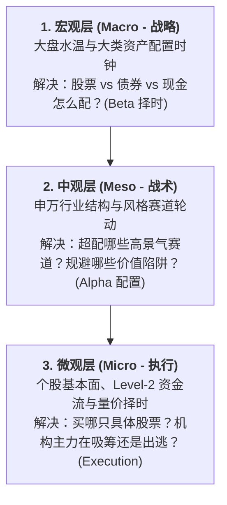
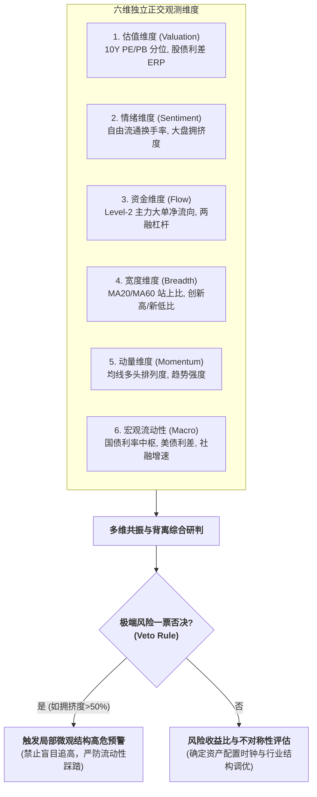

# 多维共振诊断与投研分析框架 (Multi-Dimensional Analysis Framework)

本框架吸收提炼自量化金融工程与实务多因子分析范式，核心在于**通过“宏观-中观-微观”三层解耦与多维正交信号交叉验证，识别市场微观结构异动、行业预期差与极端风险，避免单指标盲区与机械线性拟合**。

---

## 1. 宏观 - 中观 - 微观 三层投研金字塔与协同范式 (3-Tier Hierarchy)

在量化投研中，宏观、中观、微观三层**分工不同、驱动逻辑不同、决定动作不同**，必须严格解耦：



### 三层分工与反模式对照表
| 投研层级 | 研究对象 | 核心量化指标 | 决定动作 | ❌ 经典层级错位反模式 |
| :--- | :--- | :--- | :--- | :--- |
| **宏观层 (Macro)** | 总量经济、货币流动性、国债利率、通胀、GDP | 10Y 国债利率、利差、M1-M2、ERP 股债溢价、巴菲特比值 | **战略大类资产配置 (Beta)**<br>$\rightarrow$ 决定总权益风险预算 | **以微观代宏观**：因几只微盘妖股连板就盲目断定大盘全面大牛市。 |
| **中观层 (Meso)** | 申万 31 行业、162 二级行业、风格资产 (大/小盘、价值/成长/红利) | 行业 PB-ROE 四象限、行业 PE 5Y 分位、分析师预期上修比 | **战术行业轮动 (Alpha)**<br>$\rightarrow$ 决定 31 行业超配/低配 | **以宏观抹杀中观**：因宏观经济偏弱而盲目错失高景气独立赛道。 |
| **微观层 (Micro)** | 具体个股/ETF、Level-2 单笔订单分级、两融明细、个股财报 | Level-2 超大单净额、单季扣非净利 YoY、NATR 真实波幅 | **标的筛选与交易执行 (Execution)**<br>$\rightarrow$ 决定买卖点与止损位 | **以中观忽略微观**：选对了高景气行业但买入该行业内主力出逃的劣质股。 |

---

## 2. 六维正交状态观测体系与一票否决机制 (6-Dimension Observation & Veto Rule)

六维体系的核心在于**正交化状态观测与极端阈值一票否决**：



### 一票否决机制 (Veto Rule / Hard Stop)
当出现以下**单项极端阈值**时，直接触发独立高危预警，不被其他维度的温和得分稀释：
* **大盘拥挤度 $> 50\%$ 持续超 3 日**：前 5% 头部股票吸纳全市场过半流动性，对手方严重缺失，属于微观结构恶化极值；
* **两融流量杠杆率持续 $> 10\%$ 且融资净买入转负**：高风险偏好杠杆资金出现高位集中偿还出逃；
* **行业估值 5Y 分位 $> 95\%$ 叠加分析师一致预期上修比例转负**：行业高景气叙事面临业绩证伪。

---

## 3. 申万 31 行业 PB-ROE 四象限分类矩阵

基于行业估值水位（PB 5Y 滚动分位数）与行业内生盈利质量/分析师一致预期边际变化（ROE / Revision Ratio），将 31 个申万一级行业划分为四大投资象限：

```text
               ROE / 分析师预期上修 (High)
                          ↑
        [第二象限：黄金配置区]    │    [第一象限：赛道拥挤区]
      • 高景气 / 低估值          │  • 高景气 / 高估值
      • 预期差大，安全边际极高    │  • 动量强但拥挤度高，需严控回撤
  ────────────────────────┼────────────────────────→ PB 5Y 分位数 (High)
        [第三象限：周期筑底区]    │    [第四象限：价值陷阱区]
      • 低景气 / 低估值          │  • 低景气 / 高估值
      • 左侧逆向观察，等待催化剂  │  • 盈利恶化但估值虚高，坚决规避
                          │
               ROE / 分析师预期上修 (Low)
```

### 象限应用准则
1. **超配第二象限（高景气低估值）**：基本面边际改善但市场尚未充分定价，盈亏比最高；
2. **剔除第四象限（低景气高估值）**：估值虚高且基本面下行，极易遭遇估值与盈利“双杀”；
3. **监控第一象限（赛道拥挤区）**：仅在动量延续且拥挤度未破 50% 时参与，破位时果断止盈；
4. **跟踪第三象限（周期筑底区）**：左侧观察，等待行业产能出清或政策/需求催化信号。

---

## 4. 多维共振与背离诊断模型 (Resonance & Divergence Matrix)

高水平量化分析的核心在于**从多维信号的冲突中发现价格与真实微观结构的偏离**：

| 诊断场景 | 交叉信号组合 | 背后金融因果机制 | 投研结论与应对 |
| :--- | :--- | :--- | :--- |
| **微观结构恶化<br>(量价背离)** | • 指数创近期新高<br>• 大盘拥挤度 $> 50\%$<br>• 全市场成交量萎缩 | 最乐观资金已全部集中于少数头部权重股，其余 95% 股票失血，流动性对手方缺失。 | **极高见顶或风格反转预警**。提示随时可能出现“二八切换”或深度回撤。 |
| **左侧隐蔽吸筹<br>(底背离)** | • 指数低位横盘振荡<br>• 主力超大单连续 5 日净流入<br>• 两融余额企稳 | 机构主力资金在市场悲观恐慌时利用大单暗中接盘沉淀筹码。 | **左侧底部筑底信号**。适合逆向分批建仓。 |
| **估值溢价支撑<br>(股债利差共振)** | • 指数 PE 处于 90% 历史分位<br>• 10Y 国债降至 1.8% 历史低位<br>• ERP 仍处于合理中枢 | 利率中枢大幅下行导致贴现率下降，支撑了股票静态 PE 倍数的系统性扩张。 | **估值虽高但并不显著泡沫化**。结合宏观流动性审慎持有。 |
| **估值盈利双杀<br>(双顶背离)** | • 行业估值处于 5Y 95% 高位<br>• 行业分析师预期上修比例连续转负<br>• 主力资金持续净流出 | 行业高景气叙事证伪，业绩无法消化高估值，机构加速出逃。 | **坚决清仓/止损**。防范盈利与估值双杀。 |

---

## 5. 风险收益比（盈亏比）与资产配置时钟

量化分析应当输出的是**当前宏观与微观维度的“非对称风险收益比（Asymmetric Risk-Reward Profile）”**，指导动态资产再平衡：

* **低位非对称性极佳（温度低位 / ERP 10Y 极高分位）**：
  下行空间受高股息与极低估值托底有限，向上修复空间巨大，整体配置偏向**积极进攻与逢低定投**；
* **高位非对称性极差（温度高位 / 拥挤度超 50% / 巴菲特比值 95% 分位）**：
  上行空间受流动性透支挤压，向下潜在回撤风险剧增，整体配置偏向**防御再平衡、降杠杆与增配固收资产**。
