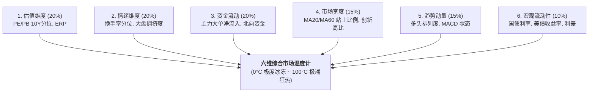

# 多维共振诊断与投研分析框架 (Multi-Dimensional Analysis Framework)

本指南吸收提炼了 `stock_analytics` 核心投研引擎的**六维市场温度计、行业 PB-ROE 四象限矩阵、多维背离诊断模型与战术资产配置契约**。

---

## 1. 六维市场温度计打分体系 (Market Temperature 0 ~ 100°C)

将全市场微观与宏观数据合成为单一直观的市场温度，衡量整体过热或冰冻程度：



### 市场温度与战术仓位映射契约
| 综合温度区间 | 市场状态定性 | 宏观资产配置建议 | 推荐权益仓位中枢 | 战术操作指南 |
| :--- | :--- | :--- | :--- | :--- |
| **0°C ~ 20°C** | 极度冰冻 / 恐慌底部 | **积极进攻 (Buy the Dip)** | **85% ~ 100% (满仓)** | 左侧逆向分批建仓，布局高弹性 Beta 与核心宽基。 |
| **20°C ~ 40°C** | 偏冷 / 筑底修复期 | **稳健加仓 (Accumulate)** | **70% ~ 85%** | 逢低定投，向景气改善的行业扩散。 |
| **40°C ~ 60°C** | 中性 / 结构性行情 | **均衡持有 (Hold & Balance)** | **50% ~ 70%** | 重视行业轮动与 Alpha 选股，淡化择时。 |
| **60°C ~ 80°C** | 偏热 / 动量加速期 | **适度防守 (Trim Profit)** | **30% ~ 50%** | 止盈高位拥挤赛道，向低估值/高股息红利防御资产再平衡。 |
| **80°C ~ 100°C** | 极端过热 / 泡沫见顶 | **全面防守 (Risk Off)** | **0% ~ 30% (轻仓/空仓)** | 大幅降低杠杆与仓位，严控回撤，增配国债或货币基金。 |

---

## 2. 申万 31 行业 PB-ROE 四象限分类矩阵

基于行业估值水位（PB 5Y 分位数）与行业盈利能力/分析师一致预期上修比例（ROE / Revision Ratio），将 31 个申万一级行业划分为四大投资象限：

```text
               ROE / 分析师预期上修 (High)
                          ↑
        [第二象限：黄金配置区]    │    [第一象限：赛道拥挤区]
      • 高景气 / 低估值          │  • 高景气 / 高估值
      • 预期差大，安全边际极高    │  • 动量强，但拥挤度高需防利空
  ────────────────────────┼────────────────────────→ PB 5Y 分位数 (High)
        [第三象限：周期筑底区]    │    [第四象限：价值陷阱区]
      • 低景气 / 低估值          │  • 低景气 / 高估值
      • 左侧逆向观察，等待催化剂  │  • 盈利恶化但估值虚高，坚决规避
                          │
               ROE / 分析师预期上修 (Low)
```

---

## 3. 多维共振与背离诊断模型 (Resonance & Divergence Matrix)

高水平量化分析的核心在于**交叉验证不同维度信号的相互矛盾与印证**：

| 诊断场景 | 交叉信号组合 | 背后金融因果机制 | 投研结论与应对 |
| :--- | :--- | :--- | :--- |
| **微观结构恶化<br>(量价背离)** | • 指数创近期新高<br>• 大盘拥挤度 $> 50\%$<br>• 全市场成交量萎缩 | 最乐观资金已全部集中于少数头部权重股，其余 95% 股票失血，流动性对手方缺失。 | **极高见顶或风格反转预警**。提示随时可能出现“二八切换”或深度回撤。 |
| **左侧隐蔽吸筹<br>(底背离)** | • 指数低位横盘振荡<br>• 主力超大单连续 5 日净流入<br>• 两融余额企稳 | 机构主力资金在市场悲观恐慌时利用大单暗中接盘沉淀筹码。 | **左侧底部筑底信号**。适合逆向分批建仓。 |
| **估值溢价支撑<br>(股债利差共振)** | • 指数 PE 处于 90% 历史分位<br>• 10Y 国债降至 1.8% 历史低位<br>• ERP 仍处于合理中枢 | 利率中枢大幅下行导致贴现率下降，支撑了股票静态 PE 倍数的系统性扩张。 | **估值虽高但并不显著泡沫化**。结合宏观流动性审慎持有。 |
| **估值盈利双杀<br>(双顶背离)** | • 行业估值处于 5Y 95% 高位<br>• 行业分析师预期上修比例连续转负<br>• 主力资金持续净流出 | 行业高景气叙事证伪，业绩无法消化高估值，机构加速出逃。 | **坚决清仓/止损**。防范盈利与估值双杀。 |
