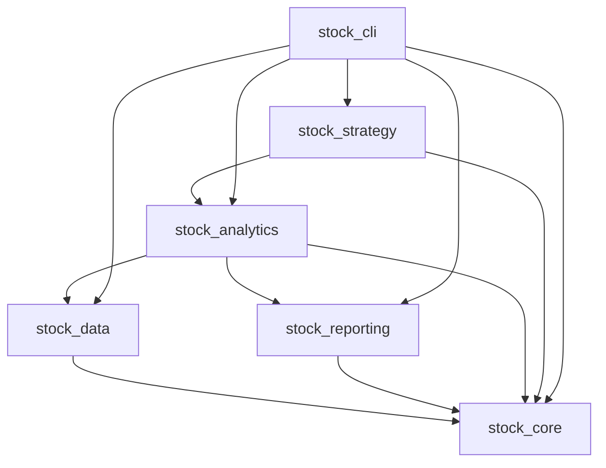

# 项目架构总览

本文档描述当前源码包、数据分层和依赖方向。具体模块实现、CLI 参数和产物字段不在这里复制；分别以代码、CLI `--help`、配置、测试和 Manifest 为准。

## 1. 源码包

项目包含 7 个顶级源码包：

| 包 | 职责 |
| --- | --- |
| `src/stock_core/` | 基础契约、领域模型、配置加载、常量与异常 |
| `src/stock_data/` | 数据源接入、RAW/Curated ETL、存储、质量与审计 |
| `src/stock_reporting/` | 报告模板、渲染器和解释配置 |
| `src/stock_analytics/` | primitives、metrics、features、marts 和分析管线 |
| `src/stock_strategy/` | 策略基类、上下文、信号和研究运行器 |
| `src/stock_cli/` | CLI 入口和应用编排 |
| `src/stock/` | 向后兼容门面 |

依赖关系以实际导入和边界检查为准，整体遵循“基础层在下、应用编排在上”的单向方向：



`stock_core` 不依赖上层业务；`stock_data` 不依赖分析和策略；分析层通过公共门面消费数据；CLI 负责组装流程，不应承载领域计算规则。

## 2. 数据流与持久化分层

```text
外部数据源
    ↓
stock_data Fetcher
    ↓
data/raw/       原始响应快照，可用于离线重放
    ↓
Cleaner → Normalizer → 质量/契约校验
    ↓
data/curated/   标准化事实表，分析与策略的事实消费层
    ↓
data/curated/mart/
                领域 Mart 和可复用特征
    ↓
stock_analytics 管线
    ↓
data/analytics/ Manifest、运行目录和展示产物
    ↓
stock_reporting Markdown/JSON 等报告视图
```

- RAW 保留源端字段和采集批次，不作为分析层的直接事实接口。
- Curated 统一日期类型、主键、单位和血统；下游读取优先使用 `DataCatalog` 等项目接口。
- Mart/Feature 是可重建的派生层，不替代 Curated。
- 分析产物以运行目录和 Manifest 为准；`latest` 只是成功运行的展示副本。

## 3. 领域职责与 Analytics 边界

顶级领域、业务域和外部调用入口见 [`architecture/domain-responsibilities.md`](architecture/domain-responsibilities.md)。
其中 `stock_analytics` 的依赖方向和导入门禁见 [`architecture/analytics-boundaries.md`](architecture/analytics-boundaries.md)：

- `primitives`：无状态纯计算，不读写物理目录；
- `metrics`：按规格从数据集计算通用指标；
- `features`：可复用特征、版本、血缘和物化；
- `marts`：具有领域语义的聚合事实；
- `pipelines`：组合事实、日期窗口、评分和产物编排。

## 4. 质量与变更原则

- 外部数据进入 Curated 前必须经过清洗、标准化和质量门禁。
- 事实、指标和报告必须保留可追溯来源；缺失和时滞不得静默掩盖。
- 新增模块先确认所属层级和依赖方向，再补充测试；不要为了复用过早增加抽象层。
- 领域工作流由 `.agents/skills/` 维护；本文件只描述稳定架构，不维护具体命令清单。
