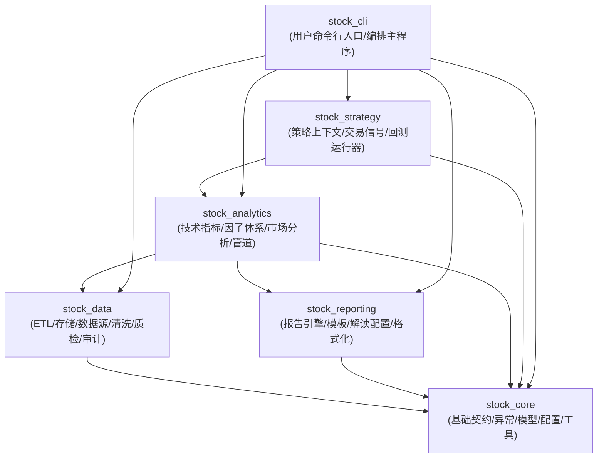

# 项目数据与系统架构设计文档

本文档详细说明了金融股票数据分析脚手架的分层架构设计、数据管道流转机制与系统设计原则。

## 1. 系统总体架构与依赖图谱 (DAG)

系统拆分为 **6 个职责清晰的顶级包**，遵循严格单向无环依赖原则：



### 数据流生命周期

```
[外部 API / 数据源] (TuShare / LiXinger / Yahoo Finance / FRED)
        │
        ▼
 [1. stock_data.Fetcher 抓取层] ──(Raw Data)──► [RAW 原始归档层 (data/raw/)]
                                                (Hive-style 时间分区: year=YYYY/month=MM)
                                                           │
                                                  (Raw Polars DataFrame)
                                                           │
                                                           ▼
                                                [2. stock_data.Cleaner 清洗层] ➔ [3. stock_data.Normalizer 标准化层]
                                                                                             │
                                                                           (Standard DataFrame + Data Lineage)
                                                                                             │
                                                                                             ▼
 [5. stock_analytics 分析层] ◄──(Zero-Copy)──► [4. stock_data.Storage 精炼存储层 (data/curated/)]
(Polars 温度计/行业结构/指标)                          (DuckDB + Parquet)
        │
        ├────────────────────────────┐
        ▼                            ▼
 [6. stock_strategy 策略层]   [7. stock_reporting 研报层]
(信号报告与上下文)           (Markdown/JSON 研报渲染)
        │                            │
        └─────────────┬──────────────┘
                      ▼
             [8. stock_cli 交互层] (用户 CLI)
```

---

## 2. 核心顶级包详解

### 2.1 基础设施包 (`src/stock_core/`)
- **核心契约 (`contracts.py`)**：定义标的身份、数据集身份 (`DatasetKey`) 与标准 Schema，不依赖任何上层业务。
- **领域模型 (`models/`)**：Pydantic 强类型行情模型与配置 Schema。
- **配置驱动 (`config/` & `config/*.yaml`)**：`settings.py` 负责环境配置，`loader.py` 负责 YAML 策略与自选池加载。
- **基础工具 (`constants.py`, `exceptions.py`, `utils/`)**：全局常量、领域异常与 Loguru 结构化日志。

### 2.2 数据中台包 (`src/stock_data/`)
- **Fetcher (`fetcher/`)**：TuShare、LiXinger、yfinance 与 FRED 接口适配与切片拉取。
- **Cleaner (`cleaner/`)**：价格逻辑校验、物理错误拦截与隔离区 (`quarantine`) 记录。
- **Normalizer (`normalizer/`)**：异构字段别名对齐、统一日期类型 (`pl.Date`) 与单位标准化。
- **Storage (`storage/`)**：DuckDB + Parquet 混合存储、SQL 查询模板与时间分区。
- **Audit & Quality (`audit/`, `quality/`, `ops/`)**：数据资产主审计、质量门禁与运维迁移脚本。

### 2.3 研报渲染包 (`src/stock_reporting/`)
- **Engine (`engine/`)**：研报渲染引擎与 Jinja2/Polars 过滤器。
- **Templates (`templates/`)**：全市场体检、行业结构、投资简报等模版。
- **Interpretation (`interpretation/`)**：指标阈值配置、区间评级与状态解读规则库（完全自包含）。

### 2.4 分析计算包 (`src/stock_analytics/`)
- **Primitives (`primitives/`)**：移动平均线、RSI、MACD 向量化技术指标。
- **Metrics & Pipelines (`metrics/`, `pipelines/`)**：六维市场温度计、分位数模型、宏观/中观/微观分析流水线。

### 2.5 策略研发包 (`src/stock_strategy/`)
- **Base & Context (`base.py`, `context.py`)**：策略生命周期抽象与只读数据上下文。
- **Runner (`runner.py`)**：研究策略执行与结构化信号报告生成。
- **Pool (`pool/`)**：双均线 RSI 交叉策略等预置量化策略。

### 2.6 交互入口包 (`src/stock_cli/`)
- **用户 CLI**：`main.py`（全流程）、`backfill.py`（回填）、`sync.py`（增量同步）、`audit.py`（审计）、`market_temperature.py`（全景体检）。

---

## 3. 核心数据流动原则

系统中的数据流转严格遵循以下 5 大设计原则：

1. **单向不可逆原则 (Unidirectional Data Flow)**：数据仅沿着依赖 DAG 单向流动，禁止跨层反向依赖。
2. **门禁契约与脏数据拦截 (Schema-First & Quality Gate)**：数据进入 `Storage` 前必须在 `Cleaner` 与 `Normalizer` 完备通过合法性校验与标准 Schema 转换，确保库内无脏数据。
3. **数据不可变性 (Immutability)**：基础行情 OHLCV 列在后续流转中只读；分析层指标通过追加派生列的方式生成新视图。
4. **零拷贝与高效传输 (Zero-Copy Transfer)**：全程以 Polars / Apache Arrow 内存结构传递，存储层与分析层之间实现零拷贝数据对接。
5. **物化解耦与无状态转换 (Stateless & Decoupled)**：分析计算与研报渲染物化解耦；各流水线通过依赖注入管理数据流，便于单元测试与隔离验证。

---

## 4. 质量保障与硬约束

- **编码标准**：通过 `.editorconfig` 约定缩进与换行，全局字符集使用 UTF-8。
- **静态检查**：Ruff 拦截格式与代码规范，Mypy 在 `strict` 模式校验类型，`scripts/lint_class_size.py` 约束类与模块规模。
- **测试覆盖率**：Pytest 单元测试覆盖率必须保持在 75% 以上。
- **自动化门禁**：通过 `make check` 实现全流程一键验证。
