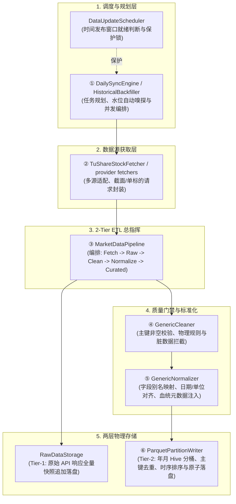

# 数据处理流水线与核心类架构 (Data Pipeline & Core Classes)

本项目针对金融数据**强时序性**、**数据量大**、**多源异构**及**外部接口多波次发布**的特点，建立了标准的 RAW/Curated ETL 流水线，并由 Mart 和分析产物承接下游派生结果。

---

## 一、从采集到落盘的核心阶段

从“**任务调度 $\rightarrow$ 网络拉取 $\rightarrow$ 管道总装 $\rightarrow$ 质检清洗 $\rightarrow$ 契约塑形 $\rightarrow$ 分桶写盘**”，数据流经以下核心组件：

---

## 二、核心组件职责详解

### 1. `DailySyncEngine`（增量引擎与水位探测）
- **源码路径**：[`src/stock_data/pipeline/sync.py`](../../src/stock_data/pipeline/sync.py)
- **职责**：
  - 调用 `DataCatalog` 逆序嗅探各数据集最新落盘交易日（Watermark）；
  - 结合 `DataUpdateScheduler` 拦截未到发布窗口的端点；
  - 规划最小必要增量区间 $(T_{last}, T_{today}]$ 并通过线程池并发执行；
  - 同步完成后自动联动 `reconciliation` 物理对账。

### 2. `TuShareStockFetcher` / provider fetchers（数据源协议转换）
- **源码路径**：[`src/stock_data/fetcher/tushare/stock_fetcher.py`](../../src/stock_data/fetcher/tushare/stock_fetcher.py)
- **职责**：
  - 封装底层 API 调用参数（`trade_date` 截面模式与 `ts_code` 标的模式）；
  - 配合全局 `RateLimiter` 线程安全限流池（如 180 次/分）；
  - 将 API 原始响应解析为标准 Polars DataFrame。

### 3. `MarketDataPipeline`（2-Tier ETL 总指挥）
- **源码路径**：[`src/stock_data/pipeline/pipeline.py`](../../src/stock_data/pipeline/pipeline.py)
- **职责**：
  - 编排单一数据集从拉取到落盘的完整生命周期；
  - 第一时间将未经修改的 API 原始响应写入 `data/raw/`（Tier-1 备份）；
  - 依次调用 Cleaner $\rightarrow$ Normalizer $\rightarrow$ PartitionWriter 完成精炼落盘（Tier-2 黄金表）。

### 4. `GenericCleaner`（质量门禁与规则拦截）
- **源码路径**：[`src/stock_data/pipeline/cleaner/generic_cleaner.py`](../../src/stock_data/pipeline/cleaner/generic_cleaner.py)
- **职责**：
  - 主键非空性检查（如 `symbol`, `trade_date` 严禁为空）；
  - 物理与金融有效性校验（OHLC 关系：`high >= low`, `open > 0` 等）；
  - 异常数据拦截并隔离记录至 `data/quarantine/`。

### 5. `GenericNormalizer`（标准契约塑形与血统注入）
- **源码路径**：[`src/stock_data/pipeline/normalizer/generic_normalizer.py`](../../src/stock_data/pipeline/normalizer/generic_normalizer.py)
- **职责**：
  - 字段别名归一（如 `ts_code -> symbol`, `date -> trade_date`）；
  - 日期统一转换为 `pl.Date` 类型；
  - 金融单位换算（如万元转元、万股转股、百分比转小数）；
  - 注入系统级数据血统列（`updated_at`, `request_id`, `data_source`, `schema_version` 等）。

### 6. `ParquetPartitionWriter`（物理分桶与原子存储引擎）
- **源码路径**：[`src/stock_data/storage/partition_writer.py`](../../src/stock_data/storage/partition_writer.py)
- **职责**：
  - **Hive 分桶路由**：自动将跨月数据拆分并路由至 `year=YYYY/month=MM/data.parquet`；
  - **内存攒批（Batch Buffer）**：在批量回填时暂存内存，避免重复磁盘 I/O；
  - **幂等合并与去重**：采用 `pl.concat(..., how="diagonal_relaxed")` 宽松合并并按主键 `unique(subset=dedup_keys, keep="last")` 去重；
  - **时序物理重排**：强制按 `["trade_date", "symbol"]` 升序排序，最大化查询谓词下推性能；
  - **原子写盘**：写 `.tmp.parquet` 并通过系统级 `replace` 原子替换，彻底防止写入坏文件。

---

## 三、记忆口诀

> **调度规划（`DailySyncEngine`）**
> $\rightarrow$ **网络拉取（`Fetcher`）**
> $\rightarrow$ **管道总装（`MarketDataPipeline`）**
> $\rightarrow$ **质检清洗（`GenericCleaner`）**
> $\rightarrow$ **契约塑形（`GenericNormalizer`）**
> $\rightarrow$ **分桶写盘（`ParquetPartitionWriter`）**
