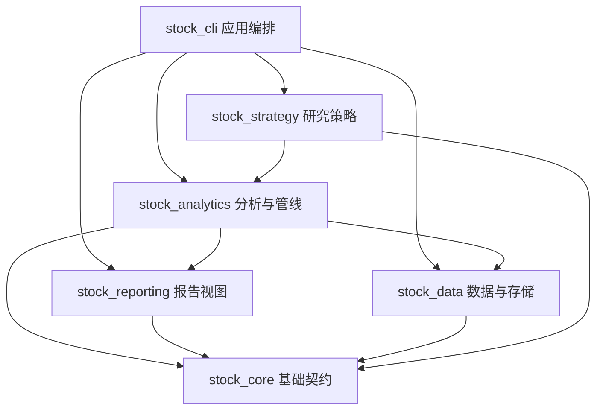

# 系统架构概览

本页是架构入口索引。稳定的包边界和数据流见 [`../architecture.md`](../architecture.md)；领域职责见 [`domain-responsibilities.md`](domain-responsibilities.md)；CLI 领域边界见 [`cli-boundaries.md`](cli-boundaries.md)；Analytics 依赖和导入边界见 [`analytics-boundaries.md`](analytics-boundaries.md)；数据存储细节见 [`../data_architecture.md`](../data_architecture.md)。

## 分层关系



## 各层职责

顶级领域与业务域的唯一职责索引见 [`domain-responsibilities.md`](domain-responsibilities.md)。本页只保留系统级分层摘要，避免复制 Analytics 内部职责表。

| 层 | 目录 | 负责内容 |
| --- | --- | --- |
| 基础契约 | `src/stock_core/` | Schema、领域模型、配置、常量和异常 |
| 数据工程 | `src/stock_data/` | Fetcher、ETL、Curated 存储、质量与审计 |
| 分析计算 | `src/stock_analytics/` | primitives、metrics、features、marts 和 pipelines |
| 报告视图 | `src/stock_reporting/` | 解释规则、模板、Markdown/JSON 渲染 |
| 策略研究 | `src/stock_strategy/` | 策略生命周期、上下文、研究应用 Facade 和结构化信号 |
| 应用入口 | `src/stock_cli/` | 参数解析、任务编排和 CLI 输出 |

`src/stock/` 仅提供向后兼容门面，不作为新功能的主要落点。

## 数据生命周期

```text
外部数据源
  → stock_data Fetcher
  → data/raw/        原始快照
  → Cleaner/Normalizer/Quality Gate
  → data/curated/    标准化事实
  → Mart/Feature
  → stock_analytics pipelines
  → stock_reporting templates
  → 运行产物 Manifest 与报告
```

下游统一通过项目数据接口读取 Curated；不要在业务代码中直接遍历 Parquet 物理目录。分析产物的具体文件和运行关系以当前 Manifest、Validator 和测试为准。

## 变更入口

- 新增数据源、回填、同步或审计能力：先看 `.agents/skills/data-pipeline/SKILL.md`；
- 新增本地数据查询：先看 `.agents/skills/data-catalog/SKILL.md`；
- 新增市场/行业/简报管线：先看 `.agents/skills/market-temperature-analysis/SKILL.md`；
- 需要改变 Analytics 分层：先阅读 [`analytics-boundaries.md`](analytics-boundaries.md) 和相关测试；
- CLI 参数和调用方式：以对应 `python -m stock_cli.<command> --help` 为准。
