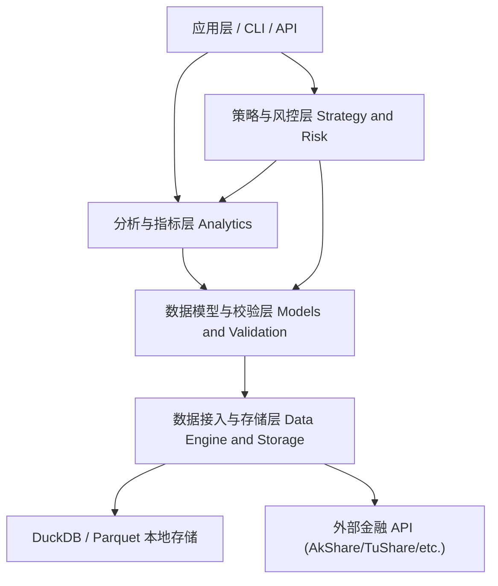

# 系统架构总览 (System Architecture Overview)

本项目采用标准的**分层架构 (Layered Architecture)** 与 **依赖倒置原则 (DIP)**，确保数据源、计算引擎与策略逻辑之间解耦。

## 一、 整体分层架构图

---

## 二、 核心分层说明与职责边界

| 架构层级 | 所在目录 | 职责描述 | 依赖约束 |
| :--- | :--- | :--- | :--- |
| **应用层 (Application)** | `src/stock/main.py`, `src/stock/cli/` | 组装各层组件，提供命令行交互或 API 接口 | 可依赖下层所有模块 |
| **策略与风控层 (Strategy)** | `src/stock/strategy/` | 交易信号生成、回测逻辑、仓位管理与风控计算 | 仅依赖 Analytics, Models |
| **分析与指标层 (Analytics)**| `src/stock/analytics/` | 技术指标 (SMA/EMA/RSI/MACD)、因子计算 (Polars 向量化) | 仅依赖 Models |
| **模型与校验层 (Models)** | `src/stock/models/`, `src/stock/exceptions.py` | 统一数据结构定义、Pydantic 校验、领域异常定义 | 无依赖（核心基础） |
| **数据与存储层 (Data)** | `src/stock/data/` | 外部 API 适配器 (Fetcher) + DuckDB/Parquet 本地缓存 (Storage) | 依赖 Models |

---

## 三、 设计原则

1. **单向依赖原则**: 依赖关系严格由上至下流转，下层模块（如 `Models` 或 `Data`）绝不允许反向依赖上层模块（如 `Strategy` 或 `Application`）。
2. **接口与实现分离**: 行情抓取器抽象为 `BaseDataFetcher` 接口，外部数据源实现作为插件式组件注入。
3. **不可变数据传输**: 模块间批量行情数据传递统一使用不可变的 `Polars DataFrame`。
