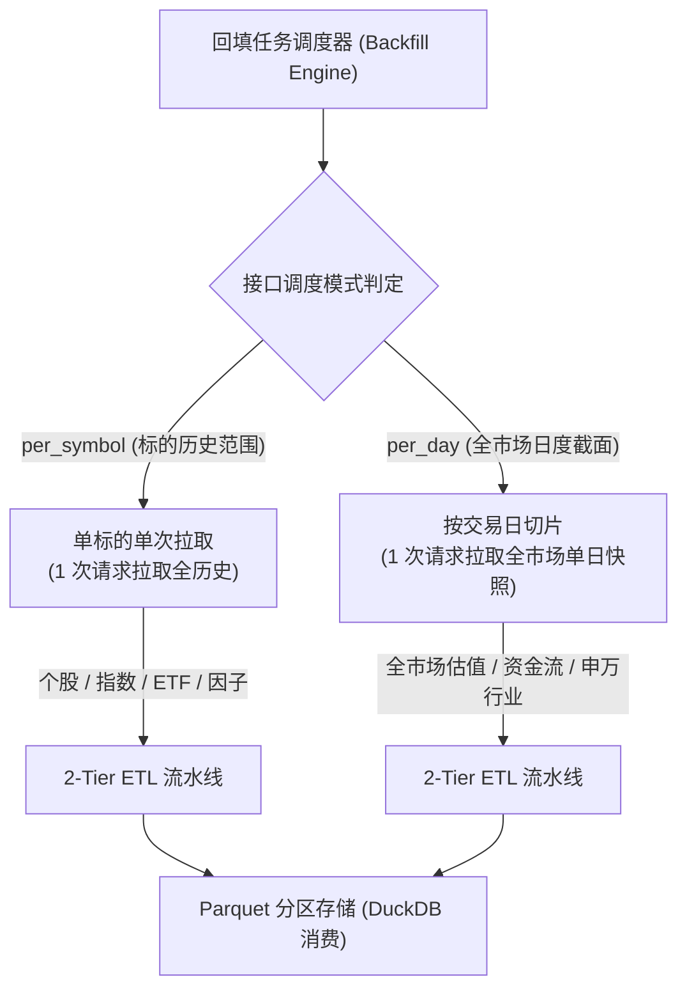
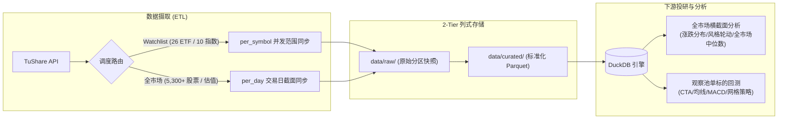

# 多品类市场数据摄取与调度规则手册

本文档定义了本项目在处理不同资产类别（股票、指数、ETF/基金、行业）及不同分析场景（观察池深度回测 vs 全市场截面分析）时的数据摄取范式、调度机制与存储契约。

---

## 1. 核心调度模式：`per_symbol` vs `per_day`

在 2-Tier ETL 架构中，数据摄取引擎依据上游 API 契约与业务分析粒度，严格划分为两种抓取调度模式：



### 模式对比与性能特征

| 维度 | `per_symbol`（按标的范围查询） | `per_day`（按交易日切片查询） |
| :--- | :--- | :--- |
| **典型数据集** | `stock_daily_bar`, `index_daily_bar`, `fund_daily`, `fund_adj`, `etf_share_size` | `daily_basic` (估值), `moneyflow` (资金流), `sw_daily` (行业行情), 全市场 `daily` |
| **请求参数** | `ts_code=xxx`, `start_date=YYYYMMDD`, `end_date=YYYYMMDD` | `trade_date=YYYYMMDD` (无需传 `ts_code`) |
| **请求次数 (10 年)** | 取决于标的数量（如 26 只 ETF = **26 次请求**） | 取决于交易日数（10 年 ≈ **2,420 次请求**） |
| **耗时与吞吐** | 秒级（26 只标的约 1~2 分钟） | 分钟级（10 年全市场约 13 分钟） |
| **适用场景** | 核心观察池（Watchlist）个股/ETF 策略回测、因子计算 | 全市场宏观扫描、全市场截面选股、赚钱效应与风格分析 |

增量同步与历史回填都以项目任务名作为入口。比如 A 股核心指数日线的项目任务名是 `index_daily_bar`，底层 TuShare API 才是 `index_daily`。`per_symbol` 增量任务会按观察池展开到单标的，并使用每个标的自己的水位与 `base_date` 规划补齐范围。

---

## 2. 各资产类别与接口契约矩阵

| 资产类别 | 典型接口 / 数据集 | 调度模式 | 数据源 | 主键定义 (`primary_keys`) | 契约特性与边界处理 |
| :--- | :--- | :--- | :--- | :--- | :--- |
| **个股日线** | `stock_daily_bar` (`daily`) | `per_symbol` | TuShare | `[ts_code, trade_date]` | 观察池回填时自动对齐上市基准日（`base_date`） |
| **全市场股票日线** | `stock_daily_bar` (`daily`) | `per_day` | TuShare | `[ts_code, trade_date]` | 传入 `SYMBOL=all` 时以交易日为单位拉取全市场 5,300+ 股票当日行情 |
| **核心指数日线** | `index_daily_bar` (`index_daily`) | `per_symbol` | TuShare | `[ts_code, trade_date]` | 支持 A 股核心指数自发布基日连续记录 |
| **ETF/场内基金日线** | `fund_daily` | `per_symbol` | TuShare | `[ts_code, trade_date]` | 支持场内 ETF 连续交易行情与成交统计 |
| **ETF 复权因子** | `fund_adj` | `per_symbol` | TuShare | `[ts_code, trade_date]` | **重要**：若标的从未分红除权，源端返回 0 行，系统标记为 `skipped` 而非网络失败 |
| **ETF 份额与规模** | `etf_share_size` | `per_symbol` | TuShare | `[ts_code, trade_date]` | 记录 ETF 每日份额与资产净值规模变动 |
| **申万行业日行情** | `sw_daily` | `per_day` | TuShare | `[ts_code, trade_date]` | 每日单次返回 31 个申万一级行业的涨跌幅与成交量快照 |
| **每日估值指标** | `daily_basic` | `per_day` | TuShare | `[ts_code, trade_date]` | 全市场 5,300+ 股票当日 PE、PB、换手率、总市值截面 |

---

## 3. 全市场分析 vs 观察池分析架构



### 1. 观察池深度回测（Watchlist Focus）
- **标的范围**：由 `config/universe/watchlist.yaml` 集中管理（核心观察池为单一信任源）。
- **上市基日对齐**：每只标的根据其 `base_date` 自动截断拉取区间，避免无效历史空查。
- **存储结构**：数据归一化后写入统一 Parquet，DuckDB 按 `symbol` 极速索引。

### 2. 全市场变化分析（Cross-Sectional Analytics）
- **截面统计**：通过 DuckDB 直接执行 SQL 计算全市场每日涨跌家数、中位数收益率、极端分位数：
  ```sql
  SELECT
      trade_date,
      count(*) as total_stocks,
      median(pct_chg) as market_median_return,
      count(CASE WHEN pct_chg >= 9.9 THEN 1 END) as limit_up_count,
      sum(amount) as market_turnover
  FROM read_parquet('data/curated/tushare/market=CN/stock_daily_bar/*/*/*.parquet')
  GROUP BY trade_date ORDER BY trade_date;
  ```
- **多表关联**：通过 `[symbol, trade_date]` 将行情表与估值表秒级 JOIN，进行低估值高弹性因子筛选。

---

## 4. 异常与边界处理准则

1. **空复权因子容错（Zero-Event Resilience）**：
   - 对于 `fund_adj` 等事件型/复权型接口，历史回填中单标的从未分红除权导致源端返回 0 行属于正常业务状态，可记录为跳过而不阻断后续标的。
   - 每日增量同步中，`NO_DATA_EXPECTED` 表示按任务契约本来允许无记录，`NO_DATA_SOURCE` 表示上游请求成功但返回空结果；真实网络、HTTP、解析或存储异常统一为 `FAILED`。CLI 只对 `FAILED` 退出失败，并在执行报告中保留原因。
2. **全局并发与限流单例（RateLimiter Singleton）**：
   - 全局通过 `get_shared_fetcher()` 维护单例连接池与 `RateLimiter`（默认 180 次/分钟），避免多线程并发击穿 API 频控。
3. **攒批合并落盘（Micro-batching）**：
   - 在大规模批量回填时，`ParquetPartitionWriter` 与 `RawDataStorage` 自动开启攒批模式，每处理 500 个标的或全流程结束时统一 Commit，消除 I/O 碎片与写锁冲突。
4. **缓存命中必须同时满足日期与标的**：
   - RAW 与 Curated 缓存检查不能只看同月文件是否存在，必须确认目标业务日期与目标标的在文件内同时存在；否则应继续回填，避免 A 标的缺口被 B 标的同月数据掩盖。

---

## 5. 标准 CLI 操作参考

```bash
# 1. 回填 26 只自选 ETF 全历史日线行情、规模与复权因子 (自动对齐上市基日)
make backfill START=2005-01-01 END=2026-08-14 SOURCE=tushare ENDPOINT=fund_daily,etf_share_size,fund_adj SYMBOL=watchlist FORCE_REFRESH=1

# 2. 回填 12 年全市场 5300+ 股票每日行情 (per_day 截面模式)
make backfill START=2014-01-01 END=2026-08-14 SOURCE=tushare ENDPOINT=stock_daily_bar SYMBOL=all

# 3. 回填 12 年全市场每日估值截面 (daily_basic)
make backfill START=2014-01-01 END=2026-08-14 SOURCE=tushare ENDPOINT=daily_basic

# 4. 月频/宏观与自选池标的：无需传入 START/END 时间参数（系统自动推导全历史/上市首日）
# 4.1 FRED 宏观时序全量历史一键回填 (自动 1970~至今)
make backfill SOURCE=fred

# 4.2 中国月度 CPI/PPI/PMI 全量历史一键回填 (自动统计局首发~至今)
make backfill SOURCE=tushare ENDPOINT=cn_cpi,cn_ppi,cn_pmi

# 4.3 理杏仁 M1/M2 与社融月度数据
make backfill SOURCE=lixinger ENDPOINT=cn_m,sf_month

# 4.4 自选 ETF 全量历史一键回填 (自动按各 ETF 上市首日全量拉取)
make backfill SOURCE=tushare ENDPOINT=fund_daily,etf_share_size,fund_adj SYMBOL=watchlist

# 5. 执行全套 Parquet 物理对账审计
make audit TYPE=reconciliation
```
