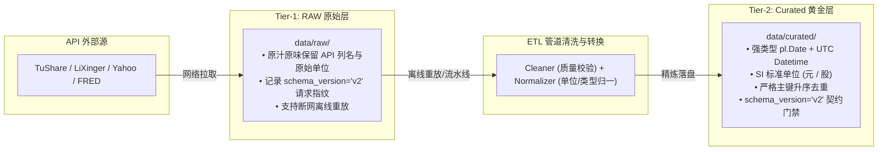

# 数据契约与 Schema v2 规范说明 (Schema v2 Specification)

本文档详细说明了金融量化系统中 **Schema v2 数据契约标准** 的设计背景、技术规范、RAW/Curated 分层表现及生命周期治理机制。

---

## 一、版本演进背景与设计目标

### 1. 历史版本（v1 / 1.0.0）痛点
- **日期类型异构**：早期文件中 `trade_date` 存在 `YYYYMMDD` 纯数字串、`YYYY-MM-DD` 文本与 `pl.Date` 混杂，导致查询与过滤时反复发生类型转换与 Join 错位；
- **单位口径模糊**：不同数据源上游单位不一（如 TuShare 金额为千元/万元、成交量为手；理杏仁为元、股），未在存储层显式规范化；
- **物理冗余与乱序**：历史快照存在重复行与乱序存储，影响 Polars 与 DuckDB 的谓词下推与分区裁剪性能；
- **血统元数据缺失**：缺少统一的时区化更新时间戳与请求指纹追踪。

### 2. Schema v2 核心目标
- **类型安全（Type Safety）**：全库统一使用强类型（`pl.Date` 与 `Datetime[us, UTC]`），消除运行时类型推断风险；
- **零歧义计量（SI Units Standardization）**：金额统一为**“元”**，量统一为**“股/份”**，比率统一为**标准小数**；
- **事实单一信任源（Single Source of Truth）**：Curated 黄金表按事实主键升序去重，作为回测与因子计算的唯一消费标准；
- **全链路血统追踪（Full Data Lineage）**：每个分区均附带数据源、接口、请求指纹与 schema 版本标识。

---

## 二、Schema v2 核心技术规范

### 1. 字段类型与元数据规范

| 字段名称 | 标准数据类型 | 业务说明与约束 |
| :--- | :--- | :--- |
| **`symbol`** | `pl.Utf8` / `pl.String` | 跨市场标的代码（如 `000001.SZ`, `AAPL`, `801010.SI`） |
| **`trade_date`** | **`pl.Date`** | **核心业务交易日**（强制使用 `pl.Date`，严禁字符串） |
| **`open` / `high` / `low` / `close`** | `pl.Float64` | 基础价格，严禁负值（物理有效性校验 `high >= low`, `open > 0`） |
| **`volume`** | `pl.Float64` | 成交量，统一单位为 **“股 / 份”**（TuShare “手” $\times 100$） |
| **`amount`** | `pl.Float64` | 成交金额，统一单位为 **“元”**（TuShare “千元” $\times 1000$ / “万元” $\times 10000$） |
| **`total_mv` / `circ_mv` / `float_mv`** | `pl.Float64` | 市值指标，统一单位为 **“元”**（万元 $\times 10000$） |
| **`turnover_rate`** | `pl.Float64` | 换手率，统一为百分比纯数值 |
| **`schema_version`** | `pl.Utf8` | **强制标记为 `"v2"`** |
| **`data_source`** | `pl.Utf8` | 数据源标识（`tushare`, `lixinger`, `yfinance`, `fred`） |
| **`updated_at`** | **`pl.Datetime("us", "UTC")`** | 微秒精度 UTC 物理落盘时间戳 |
| **`request_id`** | `pl.Utf8` | 20 位请求哈希指纹（支持离线溯源） |

### 2. 物理存储与分区组织

- **存储引擎**：Apache Parquet（采用 Snappy 压缩）；
- **Hive 分桶路径**：`data/curated/{data_source}/market={MARKET}/{dataset}/year={YYYY}/month={MM}/data.parquet`；
- **物理排序**：文件内部行数据强制按 `["trade_date", "symbol"]` 升序物理重排。

---

## 三、2-Tier 存储架构中的 v2 职责分工

---

## 四、质量门禁与契约验证

1. **契约校验器（`DatasetContract`）**：
   - 路径：[`src/stock/core/contracts.py`](file:///Users/mac/workspace/personal/finance/stock/src/stock/core/contracts.py)
   - 门禁规则：写入与加载时自动校验。若检测到 `schema_version == "v1"` 或 `trade_date` 非 `pl.Date`，系统立即以 **Fail-Closed** 机制抛出 `DataValidationError`。
2. **分布异动审计（`distribution_audit`）**：
   - 路径：[`src/stock/data/audit/distribution_audit.py`](file:///Users/mac/workspace/personal/finance/stock/src/stock/data/audit/distribution_audit.py)
   - 校验价格非负性与日均值 $10\times$ 阶跃突变，监控单位转换与数据质量。
3. **存量数据迁移与去重（`make migrate-data`）**：
   - 路径：[`src/stock/data/ops/migration.py`](file:///Users/mac/workspace/personal/finance/stock/src/stock/data/ops/migration.py)
   - 自动将存量历史文件中的列名、数值类型及 `schema_version` 批量迁移为 `v2` 标准。
